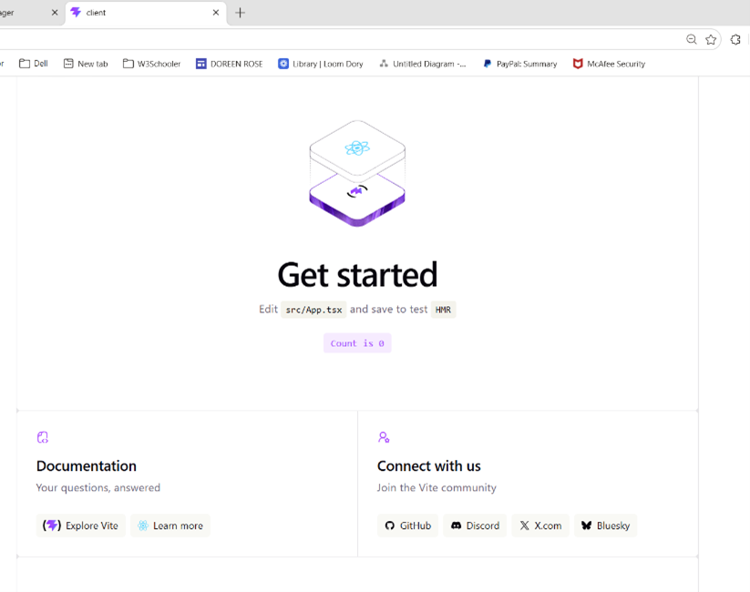
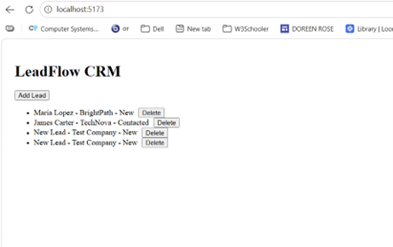
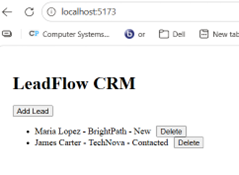
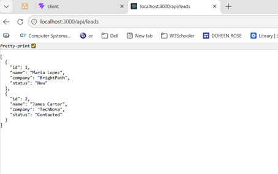
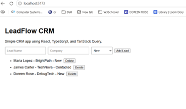
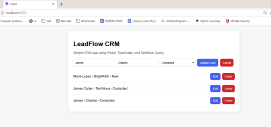
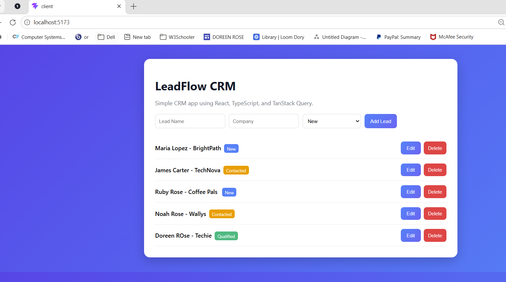

# LeadFlow CRM

A simple CRM-style web application built with React, TypeScript, TanStack Query, Node.js, and Express.
1
## Features

- Create new leads using a form
- Update existing lead information
- Delete leads from the system
- Track lead status (New, Contacted, Qualified)
- Real-time UI updates with server synchronization
- Clean and user-friendly interface

## Technologies Used

- React
- TypeScript
- TanStack Query
- Node.js
- Express
- CSS

## Application Overview

This project demonstrates how a frontend application communicates with a backend API to manage data. It highlights state management, API integration, and progressive UI improvements from initial setup to final design. 

## Application Screenshots

### Initial React Setup
Shows the starting Vite React application before building the CRM features.

 

This was the starting point of my project using a Vite React template. It shows the default setup before I built my CRM application. From here, I replaced the default components and began developing my own features. 

---

### Basic CRM Interface (Early Version)
Initial version of the LeadFlow CRM with simple layout and functionality.



This is an early version of my CRM application. At this stage, I had basic functionality working, including adding and deleting leads and displaying them in a list. I focused first on making sure the core logic worked before improving the design and user experience.

---

### Deleting a Lead
Removing a lead from the system.



This shows the delete functionality in my CRM application. Users can remove a lead from the system, and the list updates immediately after the deletion.

---

### Backend API Response
Demonstrates the backend server returning JSON data from the API.



This shows the backend API endpoint returning lead data in JSON format. I built this using Node.js and Express. The frontend calls this endpoint to fetch data, and TanStack Query handles caching and updating the UI when the data changes.

---

### Adding a New Lead
User adds a new lead using the form.



This shows the add functionality in my CRM application. The user enters lead information through the form, and when submitted, it sends a request to the backend to create a new lead. I used TanStack Query to handle the mutation and automatically update the UI after the new lead is added.
---

### Updating a Lead
Editing an existing lead and updating its information.



This shows the update functionality in my CRM application. I used a mutation with TanStack Query to send the updated data to the backend. After the update, I invalidate the query so the latest data is fetched and displayed without refreshing the page.

---

### Final Styled Application
Final version of the CRM with improved UI, styling, and user experience.



This image shows the final version of the LeadFlow CRM application. The user interface was enhanced with improved styling, cleaner layout, and more structured components to provide a better user experience. 


## How to Run

### Backend

```bash
cd server
npm install
npm run dev

npm run dev
# Leadflow-CRM
# Leadflow-CRM
